Time Series Analysis of Austrailan Imports from Japan
================
William Brasic
5/9/2021

### Clear Plot Pane, Environment, and Console

``` r
graphics.off()
rm(list=ls())
cat("\014")
```



### Set Working Directory

``` r
setwd("C:/Users/wbras/OneDrive/Desktop/GitHub/Time_Series_Jap_to_Aus_Arrivals_R")
```

### Install and Load Necessary Packages

``` r
if (!require(tidyverse)) install.packages('tidyverse')
if (!require(tsibble)) install.packages('tsibble')
if (!require(gridExtra)) install.packages('gridExtra')
if (!require(feasts)) install.packages('feasts')
if (!require(fable)) install.packages('fable')
if (!require(fabletools)) install.packages('fabletools')
if (!require(tseries)) install.packages('tseries')
if (!require(pacman)) install.packages('pacman')
if (!require(forecast)) install.packages('forecast')
if (!require(fpp3)) install.packages('fpp3')
if (!require(urca)) install.packages('urca')
if (!require(uroot)) install.packages('uroot')
if (!require(grid)) install.packages('grid')


pacman::p_load(tidyverse, tsibble, fable, fabletools, feasts)
```

## Data Preliminaries

``` r
## Load Dataset Only for Japan Exports; log Arrivals; tidy data ##
df <- fpp3::aus_arrivals %>%
  filter(Origin == 'Japan') %>%
  mutate(ln.arrivals = log(Arrivals)) %>%
  rename(origin = 'Origin', quarter = 'Quarter') %>%
  select(-Arrivals) %>%
  as_tsibble(index = quarter)
```

## Preliminary Visual Analysis

``` r
## Plotting ln.arrivals Over Time ##
time.ln.arrivals <- df %>%
  ggplot() + 
  geom_line(aes(x = quarter, y = ln.arrivals), color = '#003399', size = 1) + 
  ggtitle('Log of Int. Arrivals to Australia from Japan Over Time') + 
  theme(plot.title = element_text(hjust = 0.5)) +
  xlab('Quarter') + 
  ylab('Int. Arrivals')


## Function for Visualizing ACF and PACF ##
acf.pacf.plotter <- function(dataframe, variable, title.acf, title.pacf,
                             fill = '#FF9999') {
  
  plot.acf <- {{dataframe}} %>%
    feasts::ACF({{variable}}) %>%
    autoplot() +
    geom_bar(stat = 'identity', 
             fill = {{fill}},
             color = 'black',
             alpha = 0.7) +
    ggtitle({{title.acf}}) + 
    theme(plot.title = element_text(hjust = 0.5)) +
    xlab('Lag') + 
    ylab('ACF')
  
  plot.pacf <- {{dataframe}} %>%
    feasts::ACF({{variable}}, type = 'partial')%>%
    autoplot() +
    geom_bar(stat = 'identity', 
             fill = {{fill}},
             color = 'black',
             alpha = 0.7) +
    ggtitle({{title.pacf}}) + 
    theme(plot.title = element_text(hjust = 0.5)) +
    xlab('Lag') + 
    ylab('PACF')
  
  plot.acf.pacf <- gridExtra::grid.arrange(plot.acf, plot.pacf, ncol = 2)
  
  return(plot.acf.pacf)
  
}


## Using Above Function to Plot ACF & PACF of Series ##
acf.pacf.ln.arrivals <- acf.pacf.plotter(dataframe = df, 
                                         variable = ln.arrivals, 
                                         title.acf = 'ACF for ln.arrivals',
                                         title.pacf = 'PACF for ln.arrivals')
```

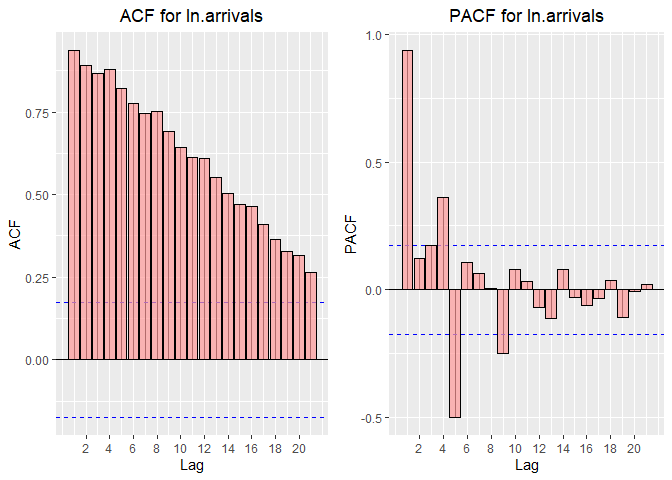<!-- -->

``` r
## ln.arrivals Against Time and ACF & PACF of the Variable ##
time.acf.pacf.ln.arrivals <- gridExtra::grid.arrange(time.ln.arrivals,
                                                     acf.pacf.ln.arrivals,
                                                     nrow = 2)
```

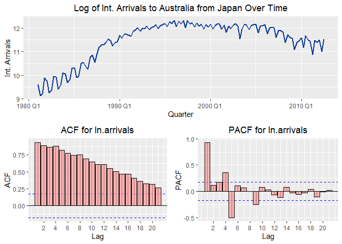<!-- -->

``` r
## Obviously a non-stationary series as it seems to exhibit both a trend and seasonality ##
```

## Formal Testing for Necessary Differencing via KPSS

``` r
## KPSS Test for Stationary around Constant ##
urca::summary(urca::ur.kpss(df$ln.arrivals, 
                          type = c("mu")))
```

    ## 
    ## ####################### 
    ## # KPSS Unit Root Test # 
    ## ####################### 
    ## 
    ## Test is of type: mu with 4 lags. 
    ## 
    ## Value of test-statistic is: 1.3974 
    ## 
    ## Critical value for a significance level of: 
    ##                 10pct  5pct 2.5pct  1pct
    ## critical values 0.347 0.463  0.574 0.739

``` r
## KPSS Test for Stationary Around Constant w/ Linear Trend ##
urca::summary(urca::ur.kpss(df$ln.arrivals, 
                          type = c("tau")))
```

    ## 
    ## ####################### 
    ## # KPSS Unit Root Test # 
    ## ####################### 
    ## 
    ## Test is of type: tau with 4 lags. 
    ## 
    ## Value of test-statistic is: 0.6267 
    ## 
    ## Critical value for a significance level of: 
    ##                 10pct  5pct 2.5pct  1pct
    ## critical values 0.119 0.146  0.176 0.216

``` r
## Hegy Test for Seasonal Unit Root ##
uroot::hegy.test(ts(df$ln.arrivals, frequency = 4),
                 deterministic = c(1,0,0), lag.method = 'fixed', maxlag=1) 
```

    ## 
    ##  HEGY test for unit roots
    ## 
    ## data:  ts(df$ln.arrivals, frequency = 4)
    ## 
    ##       statistic p-value   
    ## t_1     -2.8058  0.0512 . 
    ## t_2     -0.8317  0.2933   
    ## F_3:4      3.87  0.0238 * 
    ## F_2:4    2.8188  0.0286 * 
    ## F_1:4    4.3352  0.0039 **
    ## ---
    ## Signif. codes: 0 '***' 0.001 '**' 0.01 '*' 0.05 '.' 0.1 ' ' 1 
    ## 
    ## Deterministic terms: constant 
    ## Lag selection criterion and order: fixed, 1
    ## P-values: based on response surface regressions

``` r
## Checking Number of Necessary First Differences for ln.arrivals ##
forecast::ndiffs(df$ln.arrivals, test = 'kpss') 
```

    ## [1] 1

``` r
## Checking Number of Necessary Seasonal Differences for ln.arrivals ##
forecast::nsdiffs(ts(df$ln.arrivals, frequency=4), test = 'hegy')
```

    ## [1] 1

``` r
## Hence, a first and seasonal difference seems necessary ##
```

## First and Seasonal Differencing of Series

``` r
df <- df %>%
  mutate(d1.ln.arrivals = difference(ln.arrivals, 1)) %>%
  mutate(d1.d4.ln.arrivals = difference(d1.ln.arrivals, 4))
```

## Visual Analysis of d1.d4.ln.arrivals Series

``` r
## d1.d4.ln.arrivals Over Time ##
time.d1.d4.ln.arrivals <- df %>%
  ggplot() + 
  geom_line(aes(x = quarter, y = d1.d4.ln.arrivals), color = '#003399', size = 1) + 
  ggtitle('Log of First and Seasonally Differenced Int. Arrivals to Australia From Japan Over Time') + 
  theme(plot.title = element_text(hjust = 0.5)) +
  xlab('Quarter') + 
  ylab('Int. Arrivals')


## Using Above Function to Plot ACF and PACF of d1.d4.ln.arrivals ##
acf.pacf.d1.d4.ln.arrivals <- acf.pacf.plotter(dataframe = df, 
                                         variable = d1.d4.ln.arrivals, 
                                         title.acf = 'ACF of Time Series',
                                         title.pacf = 'PACF of Time Series')
```

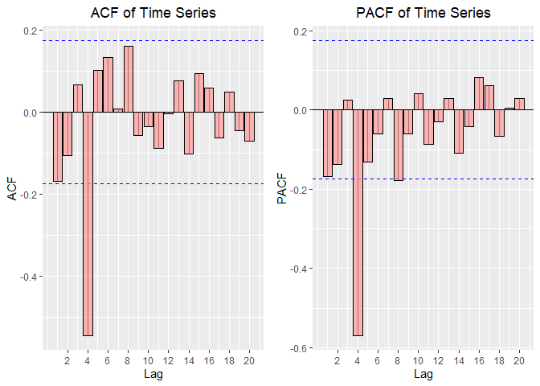<!-- -->

``` r
## d1.d4.ln.arrivals Against Time and ACF & PACF of the Variable ##
time.acf.pacf.d1.d4.ln.arrivals <- gridExtra::grid.arrange(time.d1.d4.ln.arrivals,
                                                     acf.pacf.d1.d4.ln.arrivals,
                                                     nrow = 2)
```

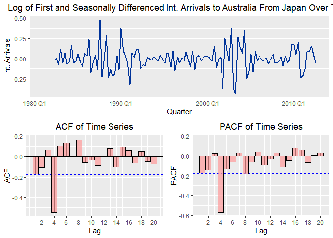<!-- -->

``` r
## Series is definitely stationary now ##
```

## Model Estimation

``` r
## Estimating Four Potential Models ##
models <- df %>%
  model("SARIMA(1,1,1)(1,1,1)" = ARIMA(ln.arrivals ~ pdq(1,1,1)+PDQ(1,1,1)),
        "SARIMA(1,1,1)(2,1,2)" = ARIMA(ln.arrivals ~ pdq(1,1,1)+PDQ(2,1,2)),
        "SARIMA(1,1,2)(1,1,2)" = ARIMA(ln.arrivals ~ pdq(1,1,2)+PDQ(1,1,2)),
        "SARIMA(1,1,1)(2,1,1)" = ARIMA(ln.arrivals ~ pdq(1,1,1)+PDQ(2,1,1)))


## Summary of First Two Models ##
grid::grid.newpage()
coef.models <- coef(models) %>%
  filter(.model == 'SARIMA(1,1,1)(1,1,1)' | .model == 'SARIMA(1,1,1)(2,1,2)') %>%
  select(-origin) %>%
  rename('Model' = .model, 'Parameter' = term, 'Parameter Estimate' = estimate,
         'S.E.' = std.error, 'Test Stat' = statistic, 'P-Value' = p.value) %>%
  mutate_if(is.double, round, 4) %>%
  gridExtra::grid.table()
```

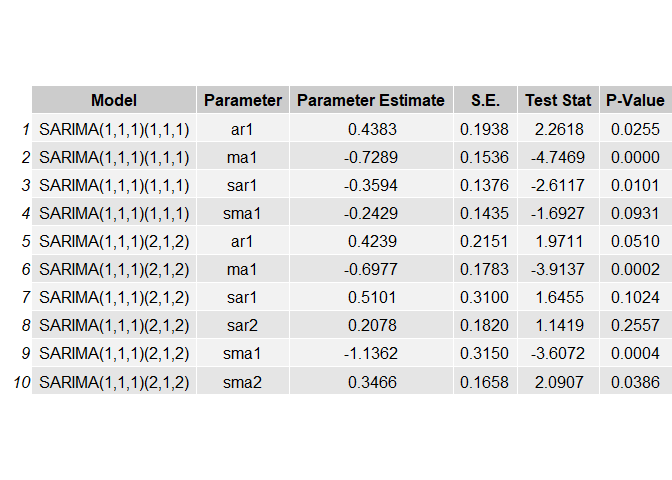<!-- -->

``` r
## Summary of Last Two Models ##    
grid::grid.newpage()
coef.models <- coef(models) %>%
  filter(.model == 'SARIMA(1,1,2)(1,1,2)' | .model == 'SARIMA(1,1,1)(2,1,1)') %>%
  select(-origin) %>%
  rename('Model' = .model, 'Parameter' = term, 'Parameter Estimate' = estimate,
         'S.E.' = std.error, 'Test Stat' = statistic, 'P-Value' = p.value) %>%
  mutate_if(is.double, round, 4) %>%
  gridExtra::grid.table()  
```

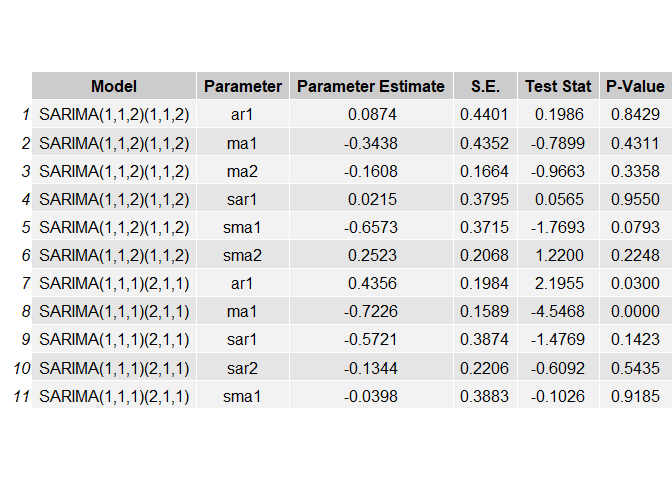<!-- -->

``` r
## Information Criteria of Models ##
grid::grid.newpage()
ic.models <- report(models) %>%
  select(.model, AIC, AICc, BIC) %>%
  rename('Model' = .model) %>%
  gridExtra::grid.table()  
```

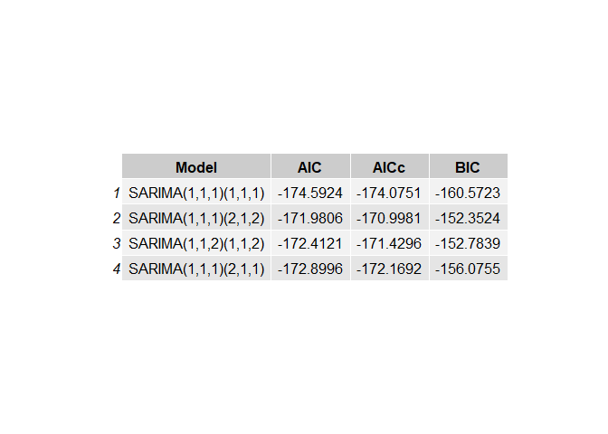<!-- -->

``` r
## Appears the SARIMA(1,1,1)(1,1,1) is best among available alternatives
```

``` r
## Running Choosen Best Model ##
sarima.111.111 <- df[, c('quarter', 'ln.arrivals')] %>%
  model(ARIMA(ln.arrivals ~ pdq(1,1,1) + PDQ(1,1,1)))
```

## Examination of SARIMA(1,1,1)(1,1,1) Model Residuals

``` r
## ACF Plot of SARIMA(1,1,1)(1,1,1) Model Residuals ##
model.residuals.acf <- residuals(sarima.111.111) %>%
  feasts::ACF(.resid) %>%
  autoplot() +
  geom_bar(stat = 'identity', 
           fill = '#FF9999',
           color = 'black',
           alpha = 0.7) +
  ggtitle('ACF for SARIMA(1,1,1)(1,1,1) Residuals') + 
  theme(plot.title = element_text(hjust = 0.5)) +
  xlab('Lag') + 
  ylab('ACF')


## PACF Plot of SARIMA(1,1,1)(1,1,1) Model Residuals ##
model.residuals.pacf <- residuals(sarima.111.111) %>%
  feasts::ACF(.resid, type = 'partial') %>%
  autoplot() +
  geom_bar(stat = 'identity', 
           fill = '#FF9999',
           color = 'black',
           alpha = 0.7) +
  ggtitle('PACF for SARIMA(1,1,1)(1,1,1) Residuals') + 
  theme(plot.title = element_text(hjust = 0.5)) +
  xlab('Lag') + 
  ylab('PACF')


## ACF and PACF Plots for SARIMA(1,1,1)(1,1,1) Together ##
sarima.111.111.residuals.acf.pacf <- gridExtra::grid.arrange(model.residuals.acf, 
                                                             model.residuals.pacf,
                                                             ncol = 2)
```

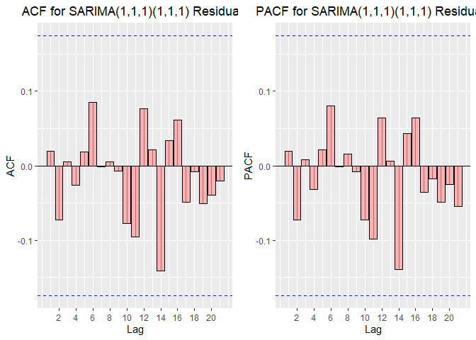<!-- -->

``` r
## Residual Correlation Test @ lag=8 for SARIMA(1,1,1)(1,1,1) ##
q.4 <- residuals(sarima.111.111) %>% 
  features(.resid, feasts::ljung_box, lag = 6, dof = 4)


## Residual Correlation Test @ lag=8 for SARIMA(1,1,1)(1,1,1) ##
q.8 <- residuals(sarima.111.111) %>% 
  features(.resid, feasts::ljung_box, lag = 10, dof = 4)


## Residual Correlation Test @ lag=8 for SARIMA(1,1,1)(1,1,1) ##
q.12 <- residuals(sarima.111.111) %>% 
  features(.resid, feasts::ljung_box, lag = 14, dof = 4)


## Adding Above Test Information to a Single DataFrame and Tidying it ##
grid::grid.newpage()
q.test.info <- bind_rows(list(q.4, q.8, q.12)) %>%
  bind_cols(Lag = c('q = 6', 'q = 10', 'q = 14')) %>%
  relocate(Lag) %>%
  select(-.model) %>%
  mutate_if(is.double, round, 4) %>%
  gridExtra::grid.table()
```

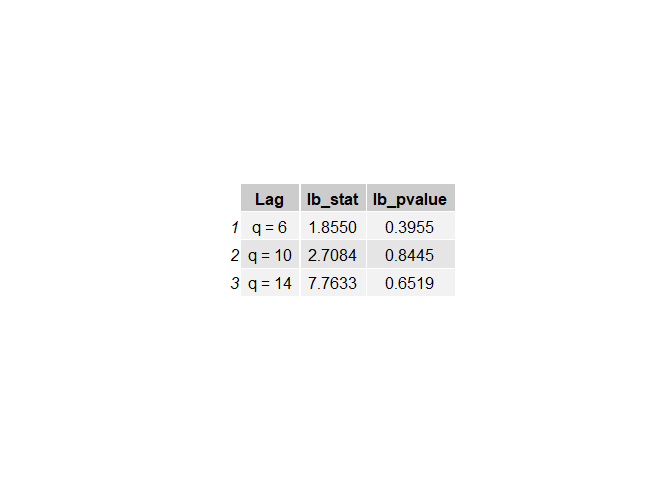<!-- -->

``` r
## Fail to reject null of zero residual autocorrelation in all three cases
```

``` r
## Testing for Conditional Heterskedasticity ##
FinTS::ArchTest(c(augment(sarima.111.111)$.resid), lags = 30)
```

    ## 
    ##  ARCH LM-test; Null hypothesis: no ARCH effects
    ## 
    ## data:  c(augment(sarima.111.111)$.resid)
    ## Chi-squared = 34.434, df = 30, p-value = 0.2638

``` r
## Fail to reject null of no (G)ARCH effects needed 
```

## Forecasting

``` r
## 12-step-ahead Forecast ##
forecast.12 <- sarima.111.111 %>%
  forecast(h = 12)


## 90% CI for Above Forecast ##
hilo(forecast.12, 90) %>%
  select(`90%`)
```

    ## # A tsibble: 12 x 2 [1Q]
    ##                     `90%` quarter
    ##                    <hilo>   <qtr>
    ##  1 [11.22548, 11.60234]90 2012 Q4
    ##  2 [11.18914, 11.65119]90 2013 Q1
    ##  3 [10.64699, 11.15844]90 2013 Q2
    ##  4 [11.17505, 11.72359]90 2013 Q3
    ##  5 [11.03025, 11.67504]90 2013 Q4
    ##  6 [11.03637, 11.74392]90 2014 Q1
    ##  7 [10.50230, 11.25977]90 2014 Q2
    ##  8 [11.02270, 11.82397]90 2014 Q3
    ##  9 [10.84992, 11.78850]90 2014 Q4
    ## 10 [10.83147, 11.85962]90 2015 Q1
    ## 11 [10.28374, 11.38319]90 2015 Q2
    ## 12 [10.79631, 11.95834]90 2015 Q3

``` r
ci.90 <- c('[11.23, 11.60]', '[11.19, 11.65]', '[10.65, 11.16]', 
           '[11.18, 11.72]', '[11.03, 11.68]', '[11.04, 11.74]',
           '[10.50, 11.26]', '[11.02, 11.82]', '[10.85, 11.79]',
           '[10.83, 11.86]', '[10.28, 11.38]', '[10.80, 11.96]')


## 12-step-ahead Forecast Table as Picture ##
grid::grid.newpage()
forecast.12.table <- forecast.12 %>%
  as_tibble() %>%
  mutate(quarter = as.character(quarter)) %>%
  select(quarter, .mean)  %>%
  rename('Quarter' = quarter, 'Point Estimate' = .mean) %>%
  mutate_if(is.double, round, 2) %>%
  bind_cols('90% C.I.' = ci.90) %>%
  gridExtra::grid.table()
```

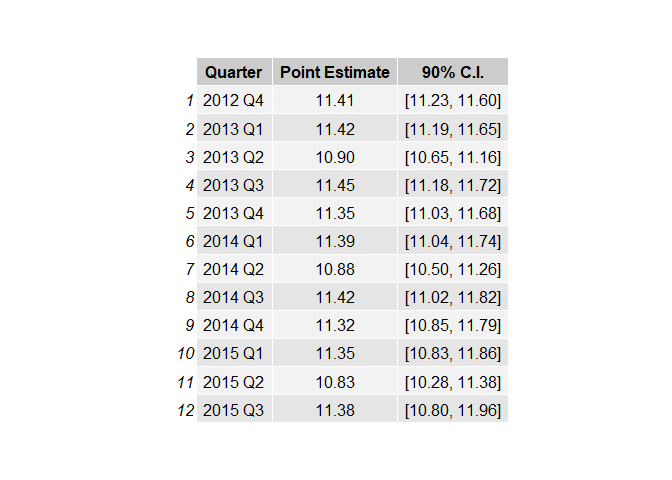<!-- -->

``` r
## 12-step-ahead Forecast w/ 90% CI Plot ##
forecast.12 %>%
  autoplot(data = df[which(as.character(df$quarter) == '2002 Q4') :nrow(df),
                     c('quarter', 'ln.arrivals')], 
           level = 90, size=1, color = '#003399') +
  theme(plot.title = element_text(hjust = 0.5)) +
  labs(title = "Forecasts of Log of Int. Arrivals to Australia From Japan",
       y = 'Log of Int. Arrivals',
       x = 'Quarter') 
```

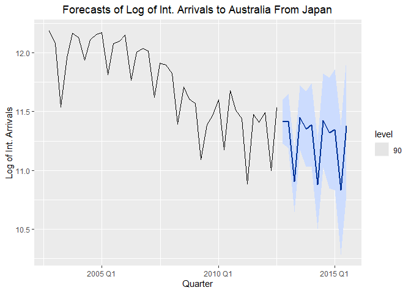<!-- -->
